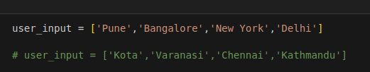
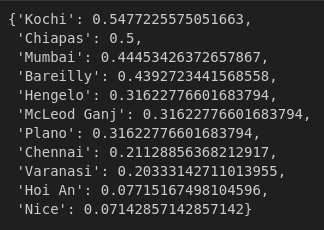
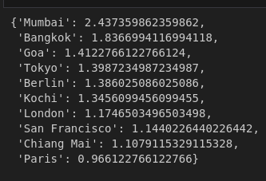
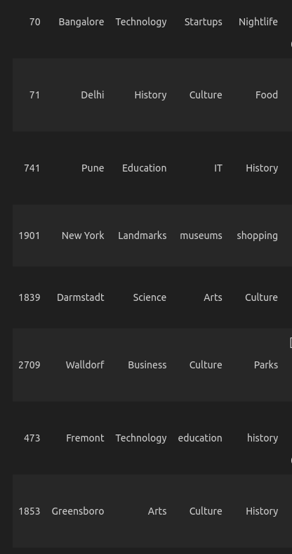

## NextStop: Trip Recommender System

- Give the list of cities you visited and get the list of cities you should visit next.

### Dataset

- The dataset used for the project is given in the 'dataset' folder.

    - The 'user_data.csv' file contains around 5,000 rows, each corresponding to a user and the cities that they visited.

    - The 'city_data.csv' file contains around around 3,000 rows, each corresponding to a city and the popular features of the city. The features tell what the city is known for, for e.g. Dubai is known for Shopping, Luxury & Architecture.

### Techniques used to train the recommender system

- 3 different models were made, each corresponding to a different technique.

- Technique 1: Item-based collaborative filtering 

    - Finding new cities based on the similarity between cities calculated using people's visits of those cities.

    - The measure for similarity is done using cosine similarity measure.

- Technique 2: User-based collaborative filtering 

    - Finding new cities for a user based on the travel history of other users who are most similar to this user.

    - The measure for similarity is done using jaccard similarity measure.

- Technique 3: Content-based filtering

    - The features of each city are used in finding similar cities.

    - Word2Vec embeddings are used to convert the features from textual representation to numerial form. 

### Output of the system

#### For the user input:

#### Output of item-based collaborative filtering:

#### Output of user-based collaborative filtering:

#### Output of content based filtering:

